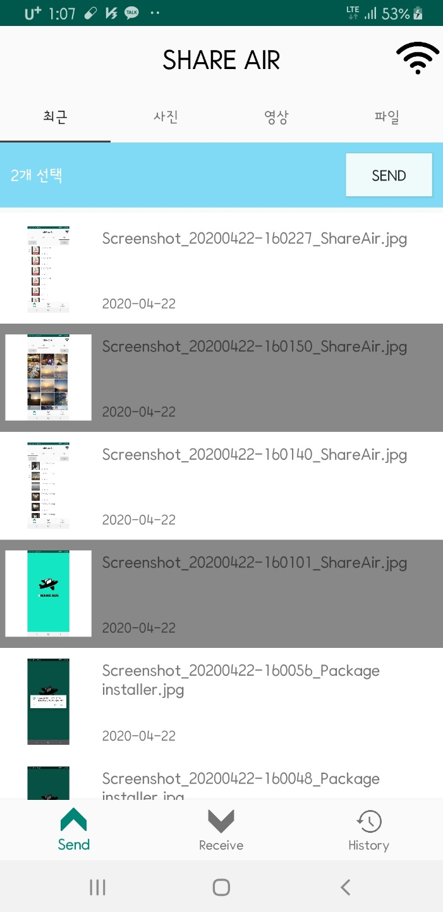
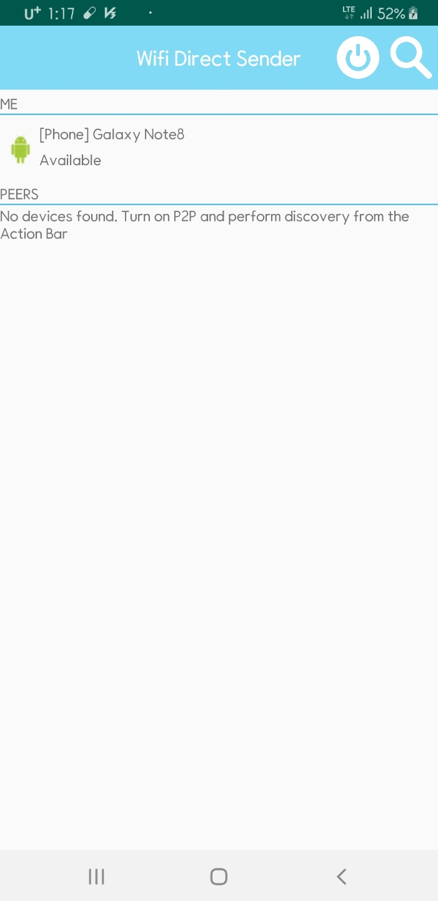
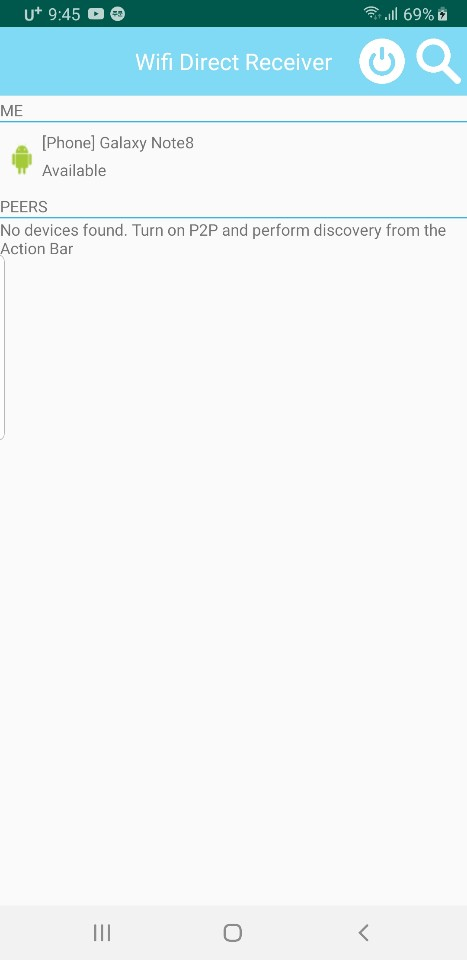
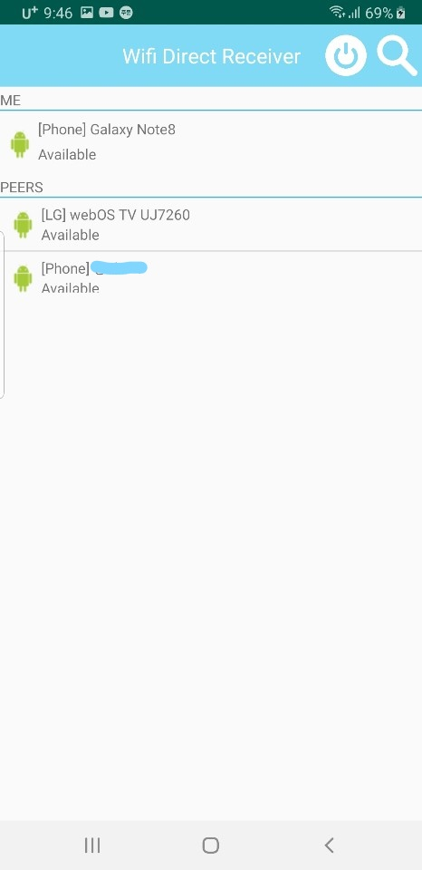
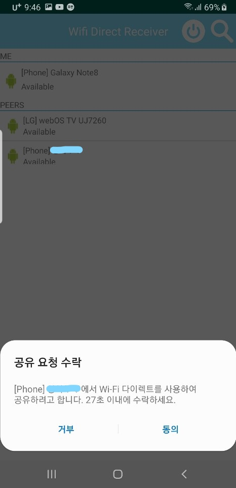
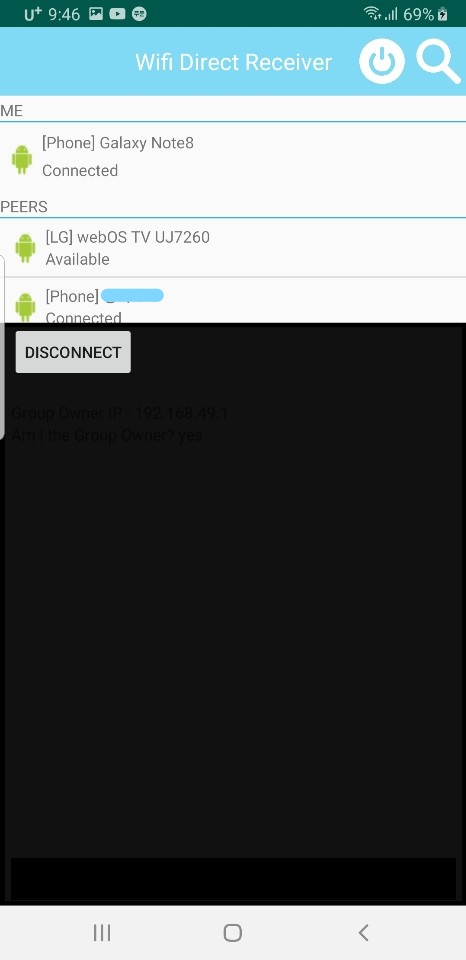
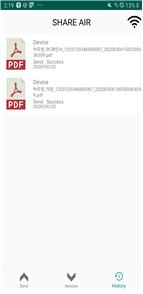

# ShareAir_Project

## App Name

#### ShareAir
* Wi-fi Direct 기술을 이용한 파일 공유 시스템 Android Application 구현
> Android 기기 기반 파일 공유 시스템  
> * 수신자는 임의의 파일을 선택한 후 [SEND] 버튼을 누르고, 송신자는 화면 하단의 [RECV] 탭을 선택하여 파일 전송 준비를 한다.  
> * 송신자와 수신자 모두 Wi-fi Direct를 활성화 시키고 서로의 기기를 검색한다.  
> * Android에서 제공하는 Wi-Fi P2P Manager API를 기반으로 연결 가능한 기기 목록을 검색한다.  
> * 위 Application은 다중 파일 및 다양한 확장자의 파일 전송을 지원한다.  
> * 현재 제공하는 서비스는 수신자가 네트워크 그룹의 owner가 되며, 송신자는 네트워크 그룹의 client로 파일을 수신자, 즉 server에 client가 파일을 업로드 하는 방식으로 파일을 전송한다.  
> * 파일을 전송하기 전 socket을 통해 연결하고 dataStream을 통해 파일을 전송한다.
> * 위 시스템에서 파일을 전송할 때 수신자는 송신자에게 하나의 파일을 받을 때마다 잘 받았다고 확인 메시지를 전송하는 과정을 거친다.  
> * 파일 전송이 완료되면 원래의 화면으로 복귀되며, History 화면에서 전송 기록을 확인할 수 있다.
> * 전송 기록은 Android platform에서 제공하는 SQLite Database API를 통해 전송 내역을 저장하고 사용자에게 보여주는 기능을 제공하고 있다.

### 프로젝트 기간
2019.09.01 - 2020.09.14
 

### Result
* Sender
> 
> 
 
 

### 
* Reciever
> 
> 
 
 

###
> * Connecting
> 
> 
 
 

###
> * History
> 
 
 

### Feature
* No Internet
> + Wi-fi가 Active한 상태라면 언제든지 파일을 서로 주고받을 수 있다.
* 기기 연결의 안정성 향상
> + 최근 블루투스 보안의 취약점이 발견되어 기기의 전화번호가 유출될 수 있다는 분석이 나왔다.  
> + 또한 단순히 블루투스를 통해 파일을 전송할 경우 Wi-fi Direct에 비해 속도가 10배 느려진다.  
> + 더불어 블루투스는 암호화 방식이 AES-128bit이기 때문에 보안 측면에서도 불리하다.  
> + 본 서비스는 연결 가능한 기기 목록 뿐만 아니라 파일을 전송하는 것 모두 Wi-fi Direct를 이용하므로 빠르고 안전하게 서비스를 이용할 수 있다.
